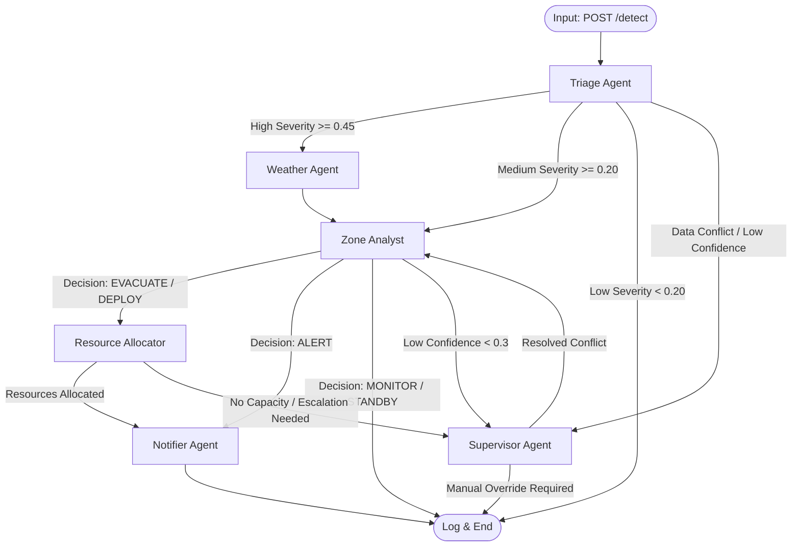

# 🧠 RakshaSetu: AI Agentic Architecture & Dataflow

This document provides a comprehensive breakdown of the LangGraph multi-agent pipeline used in RakshaSetu. It details the complete flowchart, the inner workings of each agent, the mathematical formulas used for severity calculations, and the end-to-end dataflow.

---

## 🌊 1. Complete Agentic Flowchart (LangGraph DAG)

RakshaSetu utilizes a non-linear Directed Acyclic Graph (DAG) architecture. Agents route tasks dynamically based on their findings, confidence thresholds, and system capacity.



---

## ⚙️ 2. Agent Breakdowns: Formulas, Thresholds & Parameters

### A. Triage Agent
**Role:** The entry point. It evaluates raw detection data to determine if immediate action is needed or if weather simulation should be bypassed to save compute.

**Parameters Considered:**
* `crowd_density` (0.0 to 1.0)
* `flood_level` (0.0 to 1.0)
* `structural_damage` (0.0 to 1.0)
* `fire_detected` (Boolean)
* `confidence` (Detection model confidence, 0.0 to 1.0)

**Mathematical Formula (Composite Severity):**
```python
Composite = (flood_level * 0.40) + (crowd_density * 0.30) + (structural_damage * 0.20) + (0.10 if fire_detected else 0.0)
```
*Note: Flood has the highest weight (40%) because it scales exponentially in disaster impact.*

**Thresholds & Routing Rules:**
* **Conflict Detection:** If `Composite > 0.4` BUT `confidence < 0.5` OR if `fire_detected` is True BUT `structural_damage < 0.01` $\rightarrow$ **Route to Supervisor**.
* **High Severity:** `Composite >= 0.45` $\rightarrow$ **Route to Weather Agent** (Requires full environmental analysis).
* **Medium Severity:** `0.20 <= Composite < 0.45` $\rightarrow$ **Route to Zone Analyst** (Direct analysis, skipping weather).
* **Low Severity:** `Composite < 0.20` $\rightarrow$ **Log & End**.

---

### B. Weather Agent (Stochastic Environmental Simulator)
**Role:** Projects real-time weather evolution using a stochastic differential model rather than pure LLM guessing. It calculates how terrain and elevation multiply weather risks.

**Parameters Considered:**
* Base values: `rainfall_mm`, `wind_speed_kmh`, `humidity_pct`, `temperature_c`
* Geographical factors: `terrain_type` (flat, hilly, coastal, urban, forest), `elevation_m`

**Formulas Used:**
1.  **Orographic Rainfall (Elevation Effect):**
    `Rain_elevation = max(0, elevation_m - 500) * 0.005` (Adds 0.005mm rain per meter above 500m).
2.  **Next-Step Rainfall Evolution:**
    `Rain(t+1) = Rain(t) + [((wind/100)*0.3 + (humidity/100)*0.5) * terrain_multiplier * 10] + Gaussian_Noise`
3.  **Weather Severity Composite Score:**
    `Score = min(1, rain/100)*0.5 + min(1, wind/80)*0.3 + min(1, humidity/100)*0.2 + Uniform_Noise(-0.05, 0.05)`

**Thresholds for Weather Severity:**
*   `Score >= 0.75` $\rightarrow$ **CRITICAL**
*   `Score >= 0.50` $\rightarrow$ **HIGH**
*   `Score >= 0.30` $\rightarrow$ **MEDIUM**
*   `Score < 0.30` $\rightarrow$ **LOW**

---

### C. Zone Analyst (RAG-Powered Decision Maker)
**Role:** The core analytical brain. It fuses detection data, weather simulations, and historical disaster data (RAG memory) to make an actionable decision.

**Working Mechanism:**
1.  Queries ChromaDB (Vector DB) to retrieve past events with similar weather/detection signatures.
2.  Triggers a multi-agent **AutoGen Internal Debate** between sub-agents (Risk Assessor vs. Safety Planner).
3.  Synthesizes the debate into a final decision matrix via the Local LLM.

**Outputs & Thresholds:**
*   **Decisions Generated:** `EVACUATE`, `DEPLOY_RESOURCES`, `ALERT`, `MONITOR`, `STANDBY`.
*   **Routing Logic:**
    *   If `LLM Confidence < 0.3` $\rightarrow$ **Route to Supervisor** (Uncertainty).
    *   If `EVACUATE` or `DEPLOY_RESOURCES` $\rightarrow$ **Route to Resource Allocator**.
    *   If `ALERT` $\rightarrow$ **Route to Notifier Agent** (Skip resource allocation).

**Fallback Heuristic (If LLM Engine is unavailable):**
`Composite = (crowd * 0.3) + (flood * 0.4) + (damage * 0.3)`
If `Composite >= 0.6` $\rightarrow$ EVACUATE. If `>= 0.4` $\rightarrow$ DEPLOY.

---

### D. Resource Allocator Agent
**Role:** A spatial-logic agent that manages logistics based on PostGIS queries.

**Parameters Considered:**
*   `skill_needed`: "rescue" (if EVACUATE or CRITICAL weather) vs. "any".
*   `search_radius_km`: 15.0 km from the disaster epicenter.
*   `total_capacity`: Sum of `(shelter.capacity - shelter.current_occupancy)`.

**Working Mechanism:**
1.  Queries Supabase for available Shelters and Volunteers matching the required skills.
2.  Uses an algorithmic scoring function (`scoring.py`) to generate multiple allocation plans (maximizing volunteer dispatch while minimizing travel distance to shelters).
3.  Executes an **atomic batch database update** to lock in volunteer/shelter assignments.

**Thresholds & Routing:**
*   If `total_capacity <= 0` AND the decision requires evacuation $\rightarrow$ **Route to Supervisor** (Escalation: Logistics Failure).
*   Otherwise $\rightarrow$ **Route to Notifier Agent**.

---

### E. Supervisor / Feedback Agent
**Role:** The human-in-the-loop proxy. It detects anomalies and resolves internal conflicts generated by other agents.

**Working Mechanism:**
*   **Conflict Resolution:** Looks at the entire state trace. If Triage said "Fire" but Weather said "Rain=100mm", the Supervisor recognizes the physical contradiction (likely a sensor error) and overrides the evacuation order to a "MONITOR" status.
*   It serves as the fail-safe to prevent hallucinated agent deployments.

---

## 🔄 3. Complete End-to-End Dataflow

The data travels through the system without polling, utilizing pure event-driven mechanisms.

### Phase 1: Ingestion & Trigger
1.  **Sensor/Drone Layer**: A YOLOv8 pipeline detects a disaster and sends an HTTP POST request containing `crowd_density`, `flood_level`, `fire`, etc., to the FastAPI `/api/v1/detect` endpoint.
2.  **Database Storage**: FastAPI saves the raw detection into the `detections` table in Supabase.
3.  **Background Pipeline**: FastAPI simultaneously kicks off the `_run_graph_for_zone` background task, passing the detection JSON object to the LangGraph Engine.

### Phase 2: Agent Processing (State Mutation)
1.  **State Object Initialization**: A central `AgentState` dict is created. All agents read from and write to this shared memory object.
2.  **Execution Trace**: As the `AgentState` moves from Triage $\rightarrow$ Weather $\rightarrow$ Zone Analyst $\rightarrow$ Allocator, each agent appends its output (`reasoning_steps`, `confidence`, `tools_used`) to the `execution_trace` list.
3.  **RAG Ingestion**: Concurrently, the raw detection is ingested into the **ChromaDB vector store** using `sentence-transformers` to build historical context for future runs.

### Phase 3: Actuation & Broadcasting
1.  **Database Updates**: The Resource Allocator executes PostgREST queries to decrement `available_beds` in the `shelters` table and update `volunteer.status` to 'DEPLOYED'.
2.  **Alert Generation**: The Notifier Agent generates a human-readable text block.
3.  **MQTT Publish**: The alert payload (containing the zone, message, severity, and routing path) is published to `test.mosquitto.org:1883` under a specific topic.
4.  **Logging**: Finally, the complete `execution_trace` from all agents is flattened and stored in the `agent_logs` table in Supabase.

### Phase 4: Frontend Visualization
1.  **WebSocket Receivers**: The React UI is subscribed to two data streams:
    *   **Supabase Realtime**: Instantly pushes the new `agent_logs` and updated shelter capacities to the React state.
    *   **MQTT WebSocket**: Receives the live alert payload via `test.mosquitto.org:8080`.
2.  **UI Updates**: The `LiveMap` colors the zone red (CRITICAL), the `MetricCards` update the available capacities, and the `AgentLogsPanel` visually expands to show the exact mathematical decisions the agents made.
